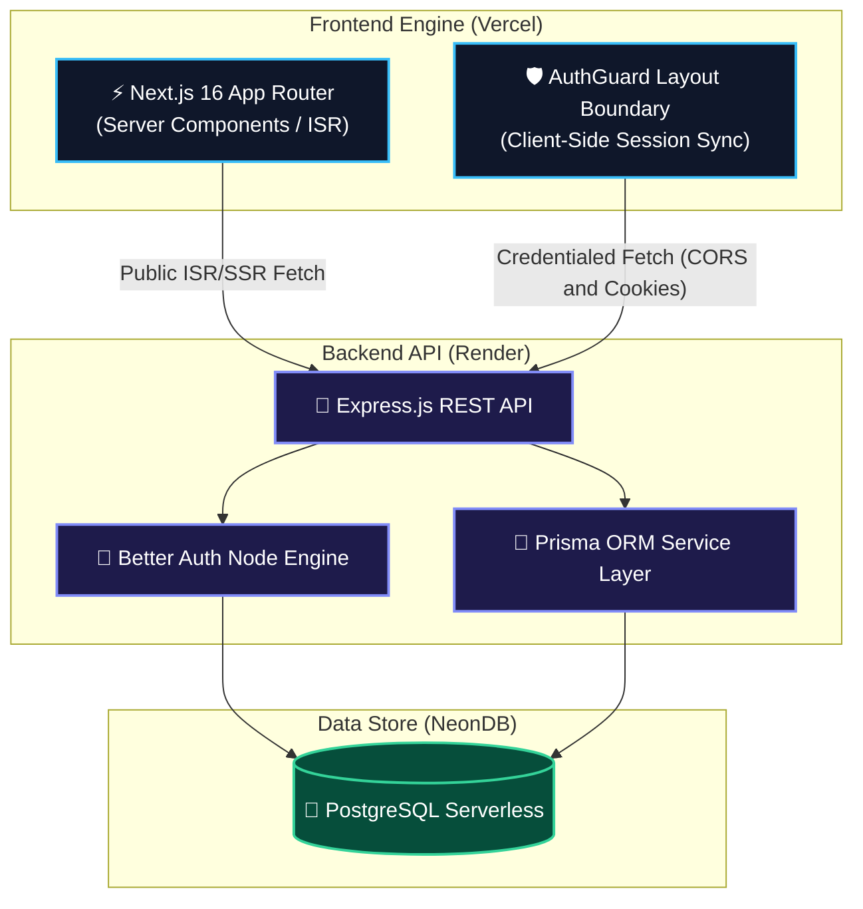

<div align="center">

# 🎟️ Eventtee — Client

**A modern, full-stack event discovery, ticket reservation, and community management platform.**

[](https://nextjs.org/)
[](https://react.dev/)
[](https://www.typescriptlang.org/)
[](https://tailwindcss.com/)
[](https://base-ui.com/)

[🌐 Live Demo](https://eventtee.vercel.app) · [📦 Frontend Repo](https://github.com/imarufbillah/eventtee-client) · [⚡ Backend Repo](https://github.com/imarufbillah/eventtee-server)

</div>

---

> [!NOTE]
> **Eventtee** is a technical portfolio project built to address real-world challenges in web applications: atomic seat reservation, cross-origin cookie authentication, dynamic multi-role access control, and zero-flicker UI transitions.

---

## ⚡ Key Product Capabilities

| Role                 | Access Level    | Core Functionalities                                                                                                                                                                                                 |
| :------------------- | :-------------- | :------------------------------------------------------------------------------------------------------------------------------------------------------------------------------------------------------------------- |
| **🌐 Public Guest**  | Unauthenticated | • Browse active events with live remaining seat counters<br>• Instant keyword search & category chip filtering<br>• View event itineraries, host details, and attendee reviews                                       |
| **🎟️ Attendee**      | `USER`          | • Atomic seat reservation with dynamic capacity locks<br>• Real-time ticket management console (Confirmed / Cancelled)<br>• Self-service ticket cancellation with instant seat restoration                           |
| **🚀 Organizer**     | `ORGANIZER`     | • Create & edit event listings (capacity, pricing, schedule)<br>• Analytics dashboard: total revenue, seat utilization rate, live listings<br>• Complete attendee roster & seat allocation inspect board             |
| **🛡️ Administrator** | `ADMIN`         | • Platform-wide governance: publish, cancel, or soft-delete events<br>• Global user registry & role modification (`USER`, `ORGANIZER`, `ADMIN`)<br>• Category creation & management • Moderation of attendee reviews |

---

## 🛠️ Architecture & Technology Stack



### Stack Breakdown

- **Core Framework**: Next.js 16.3 (App Router, Strict TypeScript)
- **UI & Components**: React 19.2, `@base-ui/react` primitives, shadcn/ui (`base-nova` preset)
- **Styling Architecture**: Tailwind CSS v4 (CSS-first `@theme inline`, OKLCH color spaces, `tw-animate-css`)
- **Animation & Motion**: Motion (`motion` v13), Lucide Icons (`lucide-react`)
- **Authentication Client**: Better Auth React Client (`better-auth/react`) + JWT Client Plugin
- **Data Fetching**: Custom API client layer with revalidation tags for Server Components & `credentials: "include"` for client state

---

## 📂 Project Structure

```text
src/
├── app/
│   ├── (auth)/             # Auth routes (sign-in, sign-up)
│   ├── (public)/           # Public landing page, event catalog, & event details
│   ├── admin/              # Admin governance board (users, events, categories, reviews)
│   ├── dashboard/          # Attendee & organizer console routes
│   ├── globals.css         # Tailwind v4 theme tokens, OKLCH palette, & custom utility classes
│   └── layout.tsx          # Root layout with ThemeProvider, TooltipProvider, Header, & Footer
├── components/
│   ├── admin/              # Admin management tables & modal dialogs
│   ├── auth/               # AuthGuard boundary, sign-in/up forms, & role selectors
│   ├── bookings/           # Attendee ticket lists & cancellation modals
│   ├── categories/         # Category navigation bars, cards, & filter chips
│   ├── dashboard/          # Dashboard metrics, widgets, & quick action cards
│   ├── events/             # Event cards, grids, detail panels, booking dialogs, & filters
│   ├── layout/             # Main navigation header, footer, & theme toggles
│   ├── motion/             # Motion reveal wrappers
│   ├── profile/            # User profile console
│   └── ui/                 # Base UI / shadcn design system primitives
├── lib/
│   ├── api-server.ts       # Server-side API fetching helper with Next.js revalidation
│   ├── auth-client.ts     # Better Auth client instance
│   ├── types.ts            # Core TypeScript domain models
│   └── utils.ts            # Utility functions (cn merger, currency formatting)
```

---

## 💡 Key Engineering Decisions

> [!TIP]
> **Client-Side `AuthGuard` for Cross-Domain Cookies**
>
> Because the Next.js app (Vercel) and Express server (Render) run on separate root domains, browser security rules block server-to-server forwarding of session cookies. To fix this cleanly without proxy overhead, protected layout boundaries (`/dashboard`, `/admin`) use a client-side `<AuthGuard />`. The component executes `useSession()` directly in the browser with `credentials: "include"`, enabling seamless authentication across domains.

> [!IMPORTANT]
> **Server Components for Public Content, Client Components for Interactivity**
>
> Public catalog pages (`/events`, `/events/[id]`) leverage Next.js Server Components with background ISR (`revalidate: 60`) for optimal initial page load speeds and SEO indexing. Interactive elements (seat quantity steppers, review posting, administrative inline controls) are isolated into dedicated client boundaries to keep JS bundle sizes lean.

---

## 🔧 Engineering Challenges & Solutions

### 1. Cross-Origin Production Cookie Rejection

- **Challenge**: In production, login cookies issued by the backend (`onrender.com`) were ignored by the browser when making requests from the frontend (`vercel.app`) due to default SameSite policies.
- **Solution**: Updated the server-side Better Auth setup with `defaultCookieAttributes: { sameSite: "none", secure: true, httpOnly: true }` and configured all client API calls with `credentials: "include"`.

### 2. Preventing Race Conditions & Overbooking

- **Challenge**: Simultaneous user bookings could exceed available seat capacity.
- **Solution**: Implemented dynamic capacity validation in the frontend seat stepper (`Math.min(remainingSeats, 10)`) coupled with atomic PostgreSQL transaction increments in the backend service layer.

---

<div align="center">

**Created by Maruf Billah**

[GitHub Profile](https://github.com/imarufbillah) · [Eventtee Client Repo](https://github.com/imarufbillah/eventtee-client) · [Eventtee Server Repo](https://github.com/imarufbillah/eventtee-server)

</div>
